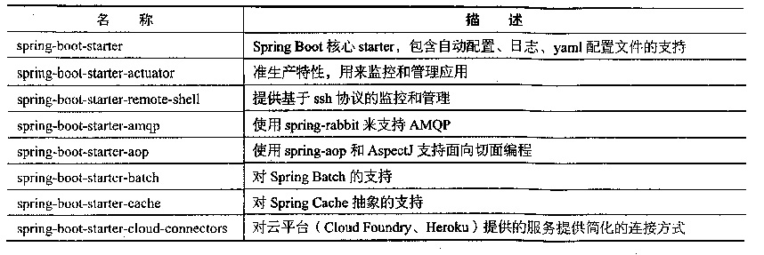

- 简单演示

    [LearningSpringBootApplication](src/main/java/com/zjc/LearningSpringBoot/LearningSpringBootApplication.java)
    
    @SpringBootApplication是Spring项目的核心注解，主要目的是开启自动配置。它是一个组合注解
```java
    @Target({ElementType.TYPE})
    @Retention(RetentionPolicy.RUNTIME)
    @Documented
    @Inherited
    @SpringBootConfiguration
    @EnableAutoConfiguration
    @ComponentScan
    @Filter
    public @interface SpringBootApplication {}
```

  其中@EnableAutoConfiguration让Spring Boot根据类路径中的jar包依赖为当前项目进行自动配置，例如添加了
spring-boot-starter依赖，会自动添加Tomcat和Spring MVC的依赖，那么Spring Boot会对Tomcat和SpringMVC进行自动配置。
如果添加了spring-boot-starter-data-jpa依赖,会自动进行JPA相关的配置。

  Spring Boot会自动扫描@SpringBootApplication所在类的同级及下级包中的Bean（JPA项目还会扫描@Entity注解的实体）。因此建议
  入口类放置在groupId+arctifactId组合的包名下。
  
  我们可以通过注解中的exclude属性来关闭特定的配置
  
  - 修改Banner
  
  在项目启动时可以看见一个默认启动图案
```
    .   ____          _            __ _ _
   /\\ / ___'_ __ _ _(_)_ __  __ _ \ \ \ \
  ( ( )\___ | '_ | '_| | '_ \/ _` | \ \ \ \
   \\/  ___)| |_)| | | | | || (_| |  ) ) ) )
    '  |____| .__|_| |_|_| |_\__, | / / / /
   =========|_|==============|___/=/_/_/_/
   :: Spring Boot ::       (v1.5.18.RELEASE)

```
在src/main/resources下新建一个banner.txt可以修改默认的启动Banner，如果需要关闭可以在
SpringApplication中调用showBanner方法

- Spring Boot配置文件

    spring boot使用一个全局的配置文件application.properties或application.yml，防止在src/main/resources目录
    下或者类路径的/config下
    
    - 简单示例
    
     将Tomcat的默认端口号8080修改为9090，并将默认访问路径"/"修改为"helloboot"。
    [application.properties](src/main/resources/application.properties)
    
- starter pom

    Spring Boot提供了可以应付绝大多数开发场景的starter pom，只要使用相应的starter pom就可以换取提供的自动配置的Bean，
    来减少手动配置
    
    除了Spring官方提供的，还有一些第三方的starter pom。
    
    Spring Boot倡导零配置，但是有时不得区使用xml配置，此时可以通过@ImportResource来加载xml的配置
    
- 常规属性设置

    在Spring中我们可以使用@Value来注入值，在Spring Boot里，我们只需要在application.properties定义属性，直接使用
    @Value注入即可,
    
    另外我们可以利用[AuthorSettings](src/main/java/com/zjc/LearningSpringBoot/config/AuthorSettings.java)这种形式，来批量注入属性，
    避免利用@Value一个一个注入
    
- 日志配置

    Spring Boot支持Java Util Logging，Log4J，Log4J2和Logback作为日志框架，Spring Boot使用Logback作为日志框架。
    
    配置日志级别：
    logging.file=D:/mylog/log.log
    logging.level.org.springframework.web=DEBUG
    
- Profile配置

    Profile是Spring用来针对不同的环境对不同的配置提供支持的，全局Profile配置使用application-{profile}.properties
    （如application-prod.properties）。
    通过在application.properties中设置spring.profiles.active=prod来指定活动的Profile。
    - 举例
    
    [application.properties](src/main/resources/application.properties) 通过spring.profiles.active=dev来指定活动的配置
    
    [application-dev.properties](src/main/resources/application-dev.properties) server.port=8888
    
    [application-prod.properties](src/main/resources/application-prod.properties) server.port=80
    

