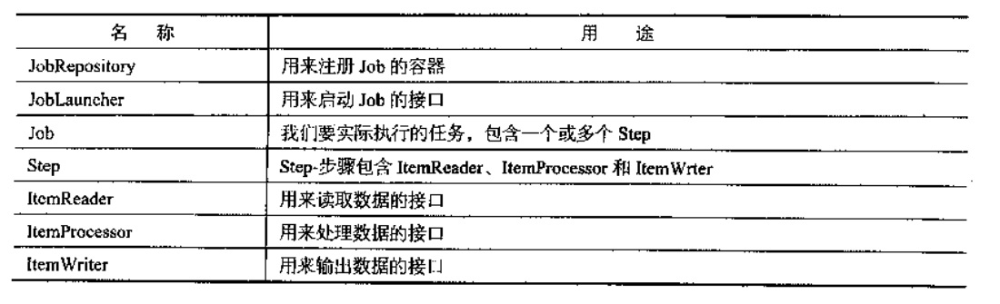

- 安全控制Spring Security
    - 快速入门
    
    Spring Security是专门针对基于Spring的项目的安全框架，充分利用了依赖注入和AOP来实现安全的功能。
    
    在早期的Spring Security版本，使用Spring Security需要使用大量XML的配置，本节将全部基于Java配置
    来实现Spring Security的功能。
    
    安全框架有两个重要的概念，即认证（Authentication）和授权（Authorization）。认证即确认用户可以访问
    当前系统；授权即用户在当前系统下的功能权限。本节将围绕认证和授权展开。
    
    - Spring Security的配置
    
    （1） DelegatingFilterProxy
    
     Spring Security为我们提供了多个过滤器来实现所有的安全的功能，我们只需注册一个特殊的DelegatingFilterProxy
     过滤器到WebApplicationInitializer即可。
     
     （2）配置
     
     SPring Security的配置和Spring MVC的配置类似，只需在一个配置类上注解@EnableWebSecurity，并让这个类继承
     WebSecurityConfigurerAdapter即可。
     
     - 用户认证
     
     认证需要我们有一套用户数据的来源，而授权则是对于某个用户有相应的角色权限，在Spring Security里我们通过
     重写`protected void configure(AuthenticationManagerBuilder auth)`方法来实现
     
     （1） 内存中的用户
     
     使用AuthenticationManagerBuilder的inMemoryAuthentication方法即可添加在内存中的用户，并可以给用户
     制定角色权限
     
     （2） JDBC中的用户
     
     JDBC中的用户直接指定dataScource即可
     
     （3） 通用的用户
     
     上面的两种用户和权限的获取方式只限于内存或者JDBC，我们的数据访问方式可以是多种多样的，可以是非关系数据库，也可以是
     常用的JPA等。
     
     - 请求授权
     
     Spring Security是通过重写`protected void configure(HttpSecurity http)`方法来实现请求拦截的。
     Spring Security使用以下匹配器来匹配请求路径：antMatchers、regexMatchers
     
    - 实战
    
    [EnterpriseSecurityStart](security/src/main/java/com/zjc/EnterpriseSecurityStart.java)
    
    [WebMvcConfig](security/src/main/java/com/zjc/config/WebMvcConfig.java)
    
    [WebSecurityConfig](security/src/main/java/com/zjc/config/WebSecurityConfig.java)
    
- 批处理Spring Batch

    Spring Batch是用来处理大量数据操作的一个框架，主要用来读取大量数据，然后进行一定处理后输出成指定的形式。
    
    - Spring Batch的主要组成
    
    
    
    如果要开启批处理还需要在配置类上使用@EnableBatchProcessing
    
    - Job监听
    
    如果需要监听我们的Job的执行情况，则定义一个类实现JobExecutionListener，并在定义Job 的Bean上绑定监听器。
    
    - 数据读取
    
    Spring Batch为我们提供了大量的ItemReader的实现，用来读取不同的数据来源
    
    - 数据处理及校验
    
    数据处理和校验都要通过ItemProcessor接口实现来完成，数据处理只需要ItemProcessor接口，重写其process方法。
    方法输入的参数是从ItemReader读取到的数据，返回给ItemWriter。
    
    我们可以JSR-303的注解，来校验ItemReader读取到的数据是否满足需求。我们可以让我们的ItemProcessor实现ValidatingItemProcessor接口。
    
    - 数据输出
    
    Spring Batch为我们提供了大量的ItemWriter的实现，用来将数据输出到不同的目的地
    
    - 计划任务
    
    Spring Batch的任务是通过JobLauncher的run方法来执行的，因此我们只需在普通的计划任务方法中执行JobLauncher的run方法即可。
    
    - 参数后置绑定
    
    我们在ItemReader和ItemWriter的Bean定义的时候，参数已经硬编码在Bean的初始化中。
    
    - 实战
    
    [EnterpriseBatchStart](batch/src/main/java/com/zjc/EnterpriseBatchStart.java)
    
- 异步消息

    异步消息主要目的是为了系统与系统之间的通信。所谓异步消息即消息发送者无需等待消息接收者
    的处理及返回，甚至无需关心消息是否发送成功。
    
    在异步消息中有两个很重要的概念，即消息代理（message broker）和目的地（destination）。
    在消息发送者发送消息后，消息将由消息代理接管，消息代理保证消息传递到指定的目的地。
    
    异步消息主要有两种形式的目的地，队列（queue）和主题（topic）。队列用于点对点（point-to-point）的
    消息通信；主题用于发布/订阅式（publish/subscribe）的消息通信。
    
    1.点对点式
    
    当消息发送者发送消息，消息代理获得消息后将消息放进一个队列（queue）里，当有消息接收者来接收消息的时候，
    消息将从队列里取出来传递给接收者，这个队列就没有了这条消息。
    
    点对点式确保的是每一条消息只有唯一的发送者和接收者，但这并不能说明只有一个接收者可以从队列里接收消息。
    因为队列里有多个消息，点对点式只保证每一条消息只有唯一的发送者和接收者。
    
    2.发布/订阅式
    
    和点对点式不同，发布/订阅式是消息发送者发送消息到主题（topic），而多个消息接收者监听这个主题。此时的消息发送者和
    接收者分别叫做发布者和订阅者。
    
    - 企业级消息代理
    
    JMS（Java Message Service）即Java消息服务。是基于JVM消息代理的规范，而ActiveMQ、HornetQ是一个
    JMS消息代理的实现。
    
    AMQP（Advanced Message Queuing Protocol）也是一个消息代理的规范，但它不仅兼容JMS，还支持跨语言和平台。
    AMQP的主要实现有RabbitMQ。
    
    - Spring的支持
    
    Spring对JMS和AMQP的支持分别来自于spring-jms和spring-rabbit。
    
    他们分别需要ConnectionFactory的实现来连接消息代理，并分别提供了JmsTemplate、RabbitTemplate来发送消息。
    
    Spring为JMS、AMQP提供了@JmsListener、@RabbitListener注解在方法上监听消息代理发布的消息。我们需要分别通过
    @EnableJms、@EnableRabbit开启支持。
    
    - Spring Boot的支持
    
    Spring Boot对JMS的自动配置支持位于org.springframework.boot.autoconfigure.jms下，支持的jms实现有ActiveMQ、
    HornetQ、Artemis，接下来将以ActiveMQ为例
    
    - 实战
    
    [EnterpriseActivemqStart](activemq/src/main/java/com/zjc/EnterpriseActivemqStart.java)
    
   项目启动后控制台会显示已接收到信息
   
- 系统集成Spring Integration

    - Spring Integration快速入门
    
        Spring Integration提供了基于Spring的EIP（Enterprise Integration Patterns，企业集成模式）的实现。Spring Integration主要解决的
        是不同系统之间的交互问题，通过异步消息驱动来达到系统交互时的松耦合。本节将基于无XML配置的原则使用Java配置、注解以及
        Spring Integration Java DSL来使用Spring Integration。
        
        Spring Integration主要由Message、Channel和Message EndPoint组成。
        
        - Message
        
        Message是用来在不同部分之间传递的数据。Message由两部分组成：消息体（payload）与消息头（header）。消息体可以是
        任何数据类型（如XML、JSON，Java对象）；消息头表示的元数据就是解释消息体的内容。
        
        - Channel
        
        在消息系统中，消息发送者发送消息到通道（Channel），消息接收者从通道（Channel）接收消息
        
        MessageChannel，是Spring Integration消息通道的顶级接口，PollableChannel具备轮询获得消息的功能，
        SubscribableChannel发送消息给订阅了MessageHandler的订阅者
        
        常用的消息通道
        
        PublishSubscribeChannel允许广播消息给所有订阅者；QueueChannel云溪消息接收者轮询获得消息，用一个队列（queue）接收消息，
        、队列的容量大小可以配置；PriorityChannel可按优先级将数据存储到堆；RenderzvousChannel确保每一个接收者
        都接收到消息后再发送消息；DirectChannel是Spring Integration默认的消息通道，它允许将消息放松给一个订阅者，然后阻塞发送直到消息被接收；
        ExeecutorChannel可以绑定一个多线程的task executor；
        
        通道拦截器
        
        Spring Integration给消息通道提供了通道拦截器（ChannelInterceptor），用来拦截发送和接收消息的操作。
        
        Message Endpoint
        
        消息端点（Message Endpoint）是真正处理消息（Message）的组件，它可以控制通道的路由。我们可用的消息端点包含如下：
        Channel Adapter，通道适配器是一种连接外部系统或传输协议的端点（EndPoint），可以分为入站（inbound）和出战（outbound）。
        通道适配器是单向的，入站通道适配器只支持接收消息，出战通道只支持输出消息；
        
        Gateway，消息网管类似Adapter，但是提供了双向的请求/返回集成方式，也分为入站（inbound）和出战（outbound）。Spring Integration
        对相应的Adapter都提供了Gateway
        
        Service Adapter可以调用Spring的Bean来处理消息，并将处理后的结果输出到制定的消息通道
        
        Router，路由可以根据消息体类型（Payload Type Router）、消息头的值（Header Value Router）以及定义好的接收表作为提交，来决定
        消息传递到的通道。
        
        Filter类似路由，不同的是过滤器不决定消息路由到哪里，而是决定消息路由可否传递给消息通道。
        
        Splitter，拆分器将消息拆分为几个部分单独处理，拆分器的返回值是一个集合或者数组。
        
        Aggregator，聚合器与拆分器相反，它接收一个java.util.List作为参数，将多个消息合并成一个消息
        
        Enricher，Transformer，Brider
        
        - 实战
        
        本章将演示读取https://spring.io/blog.atom的新闻聚合文件，atom是一个xml文件，且格式固定，我们将读取到的消息分类（Category
        ）,将消息转到不同的消息通道，将分类为releases和engineering的消息写入磁盘文件，将分类为news的消息通过邮件发送。