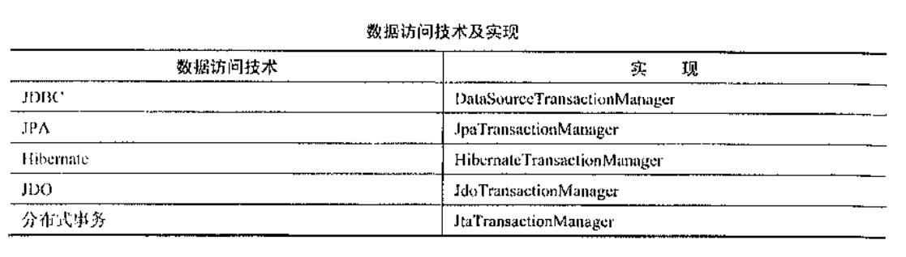
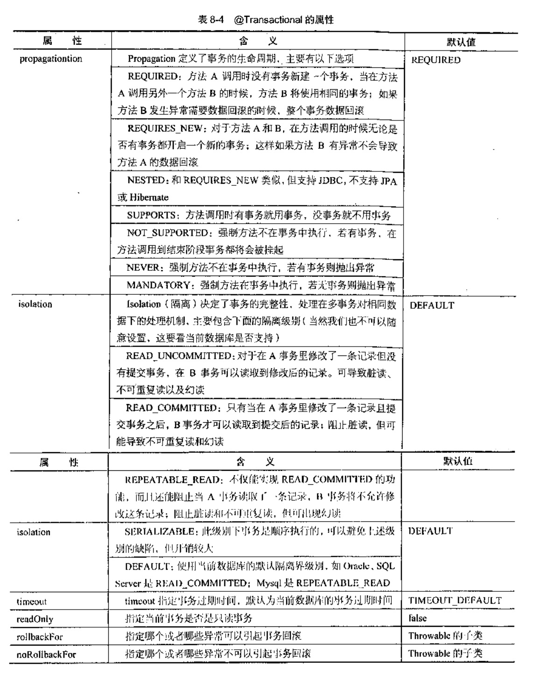
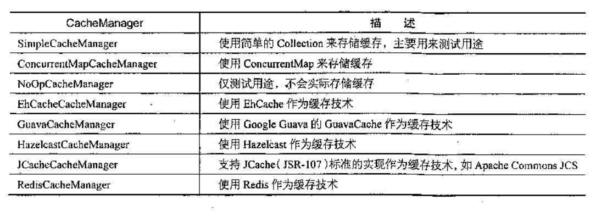
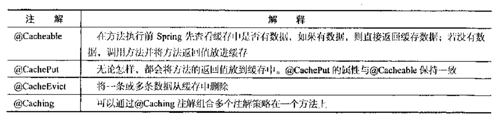
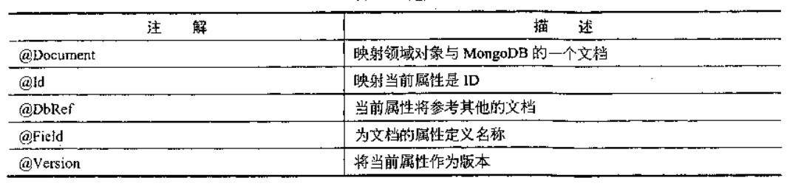

Spring Data项目是Spring用来解决数据访问问题的一揽子解决方案，Spring Data是一个伞形项目，
包含了大量关系型数据库及非关系型数据库的数据访问解决方案。Spring Data使我们可以快速且简单地
使用普通的数据访问技术及新的数据访问技术。

Spring Data包含Spring Data JPA,Spring Data MongoDB,Spring Data Neo4J,Spring Data Redis,
Spring Data Solr,Spring Data Hadoop,Spring Data GemFire,Spring Data REST,Spring Data JDBC Extensions,
Spring Data CouchBase,Spring Data Elasticsearch,Spring Data Cassandra,Spring Data DynamoDB。

Spring Data为我们使用统一的api来对上述的数据存储技术进行数据访问操作提供了支持。这是Spring通过提供
Spring Data Commons让我们使用关系型或非关系型数据访问技术时都是用基于Spring的统一标准，该标准包含
CRUD(创建、获取、更新、删除)、查询、排序和分页的相关的操作。

此处介绍下Spring Data Commons的一个重要概念:Spring Data Repository抽象。使用Spring Data Repository可以
极大地减少数据访问层的代码。

本章将学习Spring Data JPA，Spring Data MongoDB，Spring Data REST，Spring Data REDIS。

- 引入Docker

    Docker是一个轻量级容器技术，类似于虚拟机技术(xen,kvm,vmware,vitual)。Docker是直接运行在当前操作系统(linux)之上，
    而不是运行在虚拟机中，但是也实现了虚拟机技术的资源隔离，性能远远高于虚拟机技术。
    
    Docker支持将软件编译成一个镜像(image)，在这个径向力做好对软件的各种配置，然后发布这个镜像，使用者可以
    运行这个镜像，运行中的镜像称之为容器(Container)，容器的启动是很快的，一般以秒为单位。
    
    - 常用命令
    
    检索redis：`docker search redis`
    
    镜像下载：`docker pull redis`
    
    查看本地镜像列表：`docker iamges`
    
    镜像删除：`docker rmi image-id`
    
    运行：`docker run --name test-redis -d redis`

    容器列表：`docker ps`
    
    停止容器：`docker stop test-reids`
    
    启动容器：`docker start container-name/container-id`
    
    端口映射：`docker run -d -p 6378:6379 --name port-redis redis` 映射容器的6379到本机的6378端口，因为Docker
    实际上试运行在虚拟机上，所以需要做一次端口映射
    
    删除容器：`docker rm container-id`
    
    查看当前容器日志：`docker logs container-name/container-id`    
    
- Spring Data JPA

     JPA（Java Persitence API）是一个基于O/R映射的标准规范，规范即只定义标准规则，不提供实现，主要实现由
     Hibernate、EclipseLink和OpenJpa等。
     Spring Data JPA是Spring Data的一个子项目，通过提供基于JPA的Repository极大地减少了JPA作为数据
     访问方案的代码量。
    
    - 实例
    
    [DataJpaStart](jpa/src/main/java/com/zjc/DataJpaStart.java)

    
- Spring Data REST

    Spring Data JPA是基于Spring Data的repository之上，可以将repository自动输出为REST资源。目前Spring Data REST
    支持将Spring Data REST支持将Spring Data JPA、Spring Data MongoDB、Spring Data Neo4j、
    Spring Data GemFire以及Spring Data Cassandra的repository自动转换成REST服务。
    
    Spring Data REST的配置是定义在RepositoryRestMvcConfiguration（org.springframework.data.rest.webmvc.config.RepositoryRestMvcConfiguration）配置类
    中已经配置好了，我们可以通过继承此类或者直接在自己的配置类上@Import此配置类。
    
    - 实例
    
    [DataRestStart](rest/src/main/java/com/zjc/DataRestStart.java)
    
- 声明式事务

    所有的数据访问技术都有事务处理机制，这些技术提供了API用来开启事务、提交事务来完成数据操作，
    或者在发生错误的时候回滚数据。
    
    而Spring的事务机制使用同意的机制来处理不同的数据访问技术的事务处理。Spring的事务机制提供了一个
    PlatformTransactionManager接口，不同的数据访问技术的事务使用不同的接口实现，如图所示：
   
    
    
    - 声明式事务
    
    Spring支持声明式事务，即使用注解来选择需要使用事务的方法，它使用@Transactional注解，在方法
    表明该方法需要事务支持。这是一个基于AOP的实现操作。在注解的方法被调用时，会开启一个新的事务，如果出现了
    异常在Spring会提交这个事务。
    
    注意@Transactional注解来自org.springframework,transaction.annotation而不是javax.transaction.
    
    Spring提供了一个@EnableTransactionManagement注解在配置类上来开启声明式事务的支持。
    
    
    
    - 实例
    
    [DataTransactionStart](transaction/src/main/java/com/zjc/DataTransactionStart.java)
    
- 数据缓存Cache

    一个程序的平静在于数据库，我们也知道内存的速度是大大快于硬盘的速度。当我们需要重复地获取相同的数据的时候，
    我们可以利用数据缓存来解决问题。
    
    Spring定义了org.springframework.cache.CacheManager和org.springframework.cache.Cache接口来
    统一不同的缓存技术,其中,CacheManager是Spring提供的各种缓存技术抽象接口,Cache接口包含缓存的各种操作(增加、
    删除、获得缓存,我们一般不直接和此接口打交道)。
    
    - Spring支持的CacheManager
    
    
    
    Spring使用四个注解来声明缓存规则，如图所示
    
   
   
   - 实战
   
   [DataCacheStart](cache/src/main/java/com/zjc/DataCacheStart.java)
   
   
   ```
   http://localhost:8080/able?id=1
   browser:
    {
      "id" : 1,
      "name" : "汪云飞",
      "age" : 32,
      "address" : "合肥"
    }
    console:为id、key为：1 数据做了缓存
   ```
   
   再次访问上面的地址，控制台无sql打印也无输出语句说明利用了缓存
   
   - 切换缓存技术
   
   也可以利用EhCache和Guava作为缓存技术的方式，只需将相关的依赖加入pom.xml中，在类路径下
   进行配置，Spring boot会自动进行扫描

- 非关系型数据库NoSQL

    NoSQL是对于不使用关系作为数据管理的数据库系统的统称。NoSQL的主要特点是不使用SQL作为查询语句，
    数据存储也不是固定的表，字段。
    
    NoSQL数据库主要有文档存储型（MongoDB）、图形关系存储型（Neo4j）和键值对存储型（Redis）。
    本节主要演示基于MongoDB和Redis的数据访问。
    
    - MongoDB
    
    MongoDB是一个基于文档(Document)的存储型数据库，使用面向对象的思想，每一条数据记录都是文档的对象。
    
    Spring对MongoDB的支持主要是通过Spring Data MongoDB来实现的，Spring Data MongoDB为我们提供了
    如下的功能
    
    （1）Object/Document映射注解支持
    
    Spring Data MongDB提供了类似Jpa的@Entity、@Id的注解
    
    
    （2）MongoTemplate
    
    像JdbcTemplate一样，Spring Data MongoDB也为我们提供了一个MongoTemplate，其为我们提供了数据访问的方法，
    我们还需要为MongoClient以及MongoDbFactory来配置数据库连接的属性
    
    （3） Repository的支持
    
    类似Spring Data JSP，Spring Data MongoDB也提供了Repository的支持，使用方式和Spring Data JPA一样。